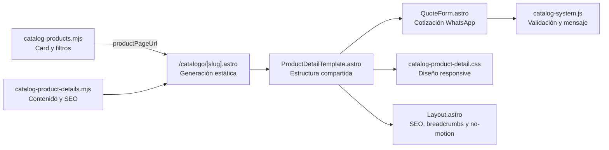

# MANEXT — Plantilla de fichas de producto del catálogo

> Fuente de verdad para crear las páginas de las familias comerciales del catálogo. La primera implementación aprobada es **Extintor CO₂ portátil** en `/catalogo/extintor-co2-portatil`.

## Estado actual

- Plantilla dinámica activa mediante `src/pages/catalogo/[slug].astro`.
- Primera ficha implementada: `co2-portatil` → `/catalogo/extintor-co2-portatil`.
- Catálogo principal enlaza la card mediante `productPageUrl` y el texto **Ver ficha técnica**.
- Cotización contextual por WhatsApp con el producto preseleccionado.
- Módulo final unificado: FAQ izquierda + cotización derecha; se apila en móvil.
- SEO activo: title, description, canonical, Open Graph, BreadcrumbList, Product y FAQPage.
- Sin precio público, `Offer`, rating ni stock estructurado inventado.
- Sin animaciones o transiciones fuera de botones.
- Gate actual: `npm run build` + `npm test`.

## No confundir con la plantilla legacy

Existen dos sistemas de producto:

| Sistema | Ruta | Fuente | Uso |
|---|---|---|---|
| Catálogo consultivo vigente | `/catalogo/[slug]` | `src/data/catalog-product-details.mjs` | Familias de producto nuevas; diseño, ficha técnica, marketing, FAQ y cotización. |
| Content Collection legacy | `/productos/[...slug]` | `src/content/productos/*.md` | Fichas históricas por capacidad; no es la plantilla para continuar el catálogo nuevo. |

Toda nueva página solicitada desde las cards de `/catalogo` debe usar el **catálogo consultivo vigente**.

## Arquitectura



## Archivos y responsabilidades

| Archivo | Responsabilidad |
|---|---|
| `src/data/catalog-products.mjs` | Datos resumidos de cards, filtros, imágenes y `productPageUrl`. |
| `src/components/catalog/CatalogCard.astro` | Muestra la card y enlaza **Ver ficha técnica** cuando existe `productPageUrl`. |
| `src/data/catalog-product-details.mjs` | Fuente de verdad del contenido completo de cada ficha nueva. |
| `src/pages/catalogo/[slug].astro` | Crea una ruta estática por cada objeto de `catalogProductDetails`. No debe contener copy específico. |
| `src/components/catalog/ProductDetailTemplate.astro` | Plantilla visual, schemas Product/FAQ y composición de secciones. |
| `src/components/catalog/QuoteForm.astro` | Formulario reutilizable; `selectedProduct` precarga el producto de la ficha. |
| `public/css/catalog-product-detail.css` | Sistema visual completo y breakpoints de la ficha. |
| `public/js/catalog-system.js` | Selección contextual, validación y generación del mensaje de WhatsApp. |
| `src/layouts/Layout.astro` | Metadatos, canonical, OG, breadcrumbs y política global sin movimiento. |
| `tests/catalog-product-detail.test.mjs` | Contratos de ruta, card, plantilla, SEO, schemas y conversión. |
| `tests/motion-policy.test.mjs` | Garantiza que el sitio no tenga animaciones y que sólo los botones conserven transición. |

## Contrato de una ficha en `catalog-product-details.mjs`

Cada producto debe incluir todos estos campos. No se deben introducir condicionales por producto en `ProductDetailTemplate.astro` si el dato puede vivir aquí.

```js
{
  id: 'co2-portatil',
  slug: 'extintor-co2-portatil',
  name: 'Extintor CO₂ portátil',
  eyebrow: 'Extintores portátiles · Dióxido de carbono',
  category: 'Extintores portátiles',
  agent: 'Dióxido de carbono (CO₂)',
  fireClasses: ['B', 'C'],
  availability: 'Cotización personalizada',
  lead: 'Propuesta principal de valor.',
  description: 'Descripción SEO/comercial amplia.',
  image: '/img/.../producto-principal.avif',
  imageAlt: 'Descripción accesible y específica.',
  galleryImage: '/img/.../producto-secundario.avif',
  galleryImageAlt: 'Descripción accesible de la segunda imagen.',
  variants: ['5 lb', '10 lb', '15 lb', '20 lb'],
  applications: ['Aplicación 1', 'Aplicación 2'],
  sectors: ['Sector 1', 'Sector 2'],
  benefits: [
    { title: 'Beneficio', text: 'Explicación verificable.', icon: 'clean' }
  ],
  technicalSpecs: [
    ['Característica', 'Valor sin inventar especificaciones de fabricante']
  ],
  capacityGuide: [
    { capacity: '10 lb', profile: 'Uso comercial', use: 'Aplicación.', note: 'Criterio de validación.' }
  ],
  recommendedUses: [
    { title: 'Aplicación', text: 'Por qué corresponde y qué debe verificarse.' }
  ],
  limitations: ['Limitación o condición de seguridad.'],
  quoteIncludes: [
    { number: '01', title: 'Paso', text: 'Qué hace MANEXT.' }
  ],
  compliance: {
    title: 'Selección y servicio con enfoque normativo',
    text: 'Alcance exacto de las NOM aplicables.',
    items: ['Criterio verificable']
  },
  faqs: [
    { question: 'Pregunta visible', answer: 'Respuesta visible y coincidente con FAQPage.' }
  ],
  seo: {
    title: '50–60 caracteres con keyword y MANEXT al final',
    description: '150–160 caracteres, intención comercial y CTA.',
    canonical: 'https://mantenimientodeextintores.mx/catalogo/slug-sin-diagonal',
    ogTitle: 'Título social',
    ogDescription: 'Descripción social'
  },
  sources: [
    { label: 'Fuente técnica oficial', url: 'https://...' }
  ]
}
```

## Anatomía visual obligatoria

1. **Hero de producto**
   - Imagen principal con dimensiones reservadas para evitar CLS.
   - Eyebrow: categoría + agente.
   - Un único H1.
   - Clases de fuego, capacidades, uso y modalidad.
   - CTA `#solicitar-cotizacion` con atributos `data-quote-product` y `data-quote-variant`.
   - Nota que aclare que imagen, marca, rating y componentes se confirman en la propuesta.
2. **Navegación interna sticky**
   - Beneficios, ficha técnica, capacidades, aplicaciones, seguridad y FAQ.
3. **Beneficios**
   - Cuatro argumentos específicos; evitar copy genérico.
4. **Ficha técnica**
   - Tabla semántica con `th scope="row"`.
   - Widget normativo con límites correctos de cada NOM.
5. **Capacidades o variantes**
   - Cada variante incluye perfil, uso, nota técnica y CTA contextual.
6. **Aplicaciones recomendadas**
   - Casos de uso, segunda imagen y advertencia sobre selección final.
7. **Seguridad y limitaciones**
   - Debe explicar también cuándo no conviene usar el equipo.
8. **Qué incluye la cotización**
   - Revisión del riesgo, selección y propuesta integral.
9. **Módulo combinado de conversión**
   - Una sola superficie visual.
   - Columna izquierda: encabezado, guía relacionada y FAQs.
   - Columna derecha: introducción, beneficios, teléfono y formulario WhatsApp.
   - Escritorio: dos columnas `.92fr / 1.08fr`.
   - Tablet/móvil (`≤820px`): una columna.
10. **Referencias técnicas**
    - Fuentes primarias visibles; abrir externas con `rel="noopener noreferrer"`.

## Contrato SEO

- URL corta, minúscula y sin diagonal final: `/catalogo/extintor-co2-portatil`.
- Canonical absoluta idéntica a la URL pública y también sin diagonal final.
- Title único de 50–60 caracteres.
- Meta description única de 150–160 caracteres.
- Un único H1 visible dentro de `.product-detail`.
- Jerarquía H2/H3 semántica.
- Alt text descriptivo; no rellenar keywords artificialmente.
- Enlaces internos a categoría, servicios y contenido relacionado.
- `Product` JSON-LD sin `offers`, `price`, `aggregateRating`, `brand` o disponibilidad si no hay datos reales verificables.
- `FAQPage` sólo para preguntas y respuestas visibles.
- `BreadcrumbList` lo genera `Layout.astro`.
- No publicar fechas falsas ni claims de stock/certificación no demostrados.

## Contrato técnico y normativo

- La información de seguridad se valida en fuentes primarias antes de escribirla.
- La NOM-002-STPS-2010 sustenta selección por clase de fuego, ubicación y condiciones de operación.
- La NOM-154-SCFI-2005 regula el servicio de mantenimiento y recarga; no debe presentarse como certificación automática de todo producto vendido.
- Los valores dependientes de marca —rating, alcance, descarga, presión, dimensiones, temperatura y peso total— se omiten o se marcan como sujetos a modelo.
- Diferenciar capacidad nominal de cobertura/rating.
- Explicar limitaciones, reignición, ventilación, incompatibilidades y riesgos del agente cuando corresponda.
- No afirmar “certificado” sin documentación del modelo cotizado.

## Política comercial y de conversión

- Modalidad pública: **Cotización personalizada**.
- No mostrar precios genéricos.
- El formulario pregunta producto, variante, cantidad, sector, ubicación, servicios, contacto y descripción del riesgo.
- El campo de producto se precarga con `selectedProduct={product.name}`.
- Los CTA de capacidad cambian el placeholder a las variantes disponibles.
- El mensaje se abre en WhatsApp para que el usuario lo revise antes de enviar.
- El formulario siempre enlaza al aviso de privacidad y valida campos requeridos.

## Política de diseño y rendimiento

- Todo el sitio permanece sin animaciones.
- Sólo botones y CTA pueden tener transiciones breves.
- Cards, imágenes, acordeones, navegación y secciones no se desplazan, escalan ni hacen fade.
- Imágenes AVIF/WebP locales; `loading="lazy"` bajo el fold y `fetchpriority="high"` sólo para la imagen principal.
- Reservar `width` y `height` para prevenir layout shift.
- Mantener CSS compartido; no crear estilos inline por producto.
- Incrementar la versión de `/css/catalog-product-detail.css?v=N` al cambiar el archivo para evitar caché obsoleto.
- Desktop máximo: contenedor de 1240 px.
- Breakpoints vigentes: 1020, 820 y 620 px.

## Cómo crear el siguiente producto

### 1. Investigar y validar

- Confirmar agente, clases de fuego, capacidades comercializadas, aplicaciones, limitaciones y normativa.
- Priorizar NOM/DOF/STPS y documentación oficial de fabricante.
- Evitar copiar claims de competidores sin evidencia.

### 2. Preparar imágenes

- Seleccionar una imagen principal y otra secundaria existentes en `public/img/`.
- Si no existen, crear/optimizar activos antes de programar la ficha.
- Escribir alt text específico para cada imagen.

### 3. Conectar la card

Agregar `productPageUrl` al producto correspondiente en `catalog-products.mjs`:

```js
productPageUrl: '/catalogo/extintor-pqs-abc-portatil',
```

No reemplazar `detailUrl`; éste puede seguir apuntando a la guía general del agente.

### 4. Agregar el detalle

Duplicar conceptualmente el objeto CO₂ dentro de `catalogProductDetails` y reemplazar **todos** los campos. No copiar limitaciones, normativa, clases o FAQ sin revisar si aplican al nuevo agente.

### 5. Revisar la ruta

`getStaticPaths()` generará la página automáticamente. No crear un `.astro` individual por producto.

### 6. Añadir pruebas

Extender `tests/catalog-product-detail.test.mjs` para comprobar:

- `productPageUrl` de la card.
- slug y objeto de detalle.
- HTML generado en `dist/catalogo/<slug>/index.html`.
- canonical, H1, Product/FAQ schema, formulario preseleccionado y ausencia de precio/ofertas ficticias.

### 7. Verificación obligatoria

```bash
npm run build
npm test
```

Después revisar en navegador:

- Desktop.
- 390 × 844 px.
- Hero, tabla, cards, imágenes, módulo FAQ/cotización y formulario.
- CTA principal y CTA de variante.
- Un H1 dentro de `.product-detail`.
- Consola sin errores propios del producto.

## Definition of Done

- [ ] Card enlaza a la ficha mediante `productPageUrl`.
- [ ] Objeto completo agregado a `catalogProductDetails`.
- [ ] Ruta sin trailing slash funciona localmente.
- [ ] Contenido técnico validado con fuentes primarias.
- [ ] Beneficios, especificaciones, capacidades, usos y limitaciones son específicos.
- [ ] SEO único y schemas coinciden con contenido visible.
- [ ] No hay precio, Offer, rating, stock ni certificación inventados.
- [ ] Formulario preselecciona el producto correcto.
- [ ] FAQ y cotización comparten el módulo de dos columnas.
- [ ] Responsive revisado en escritorio y móvil.
- [ ] No existen animaciones fuera de botones.
- [ ] `npm run build` termina con exit code 0.
- [ ] `npm test` termina con 0 fallos.
- [ ] CSS versionado si cambió el stylesheet.
- [ ] Documentación y memoria actualizadas si se modifica el contrato compartido.

## Producto de referencia

**Extintor CO₂ portátil** es la referencia canónica para todos los siguientes productos.

- URL local: `http://localhost:4310/catalogo/extintor-co2-portatil`
- Datos: `src/data/catalog-product-details.mjs`
- Card: ID `co2-portatil` en `src/data/catalog-products.mjs`
- Imagen principal: `/img/productos/co2/img-extintores-co2/Extintor-de-CO2-5lbs.avif`
- Capacidades: 5, 10, 15 y 20 lb.
- Clases: B y C.

## Siguiente secuencia recomendada

1. Extintor PQS ABC portátil.
2. Extintor de agua a presión.
3. Extintor de espuma AFFF.
4. Extintor tipo K.
5. Extintor de agente limpio.
6. Especialidades y equipos móviles.

## Referencias internas

- [[Productos — Catálogo y Plantilla]]
- [[HERO-DESIGN-SYSTEM]]
- [[Layout.astro — Props y Estructura]]
- [[Reglas del Sistema MANEXT]]
- `docs/research/2026-07-14-estudio-mercado-catalogo-extintores-mexico.md`
- `docs/plans/2026-07-14-catalogo-extintores-design.md`

## Registro

| Fecha | Cambio |
|---|---|
| 2026-07-14 | Se crea la plantilla dinámica con CO₂ como primera ficha; se conecta la card, se añade SEO/FAQ/Product schema y cotización contextual. |
| 2026-07-14 | FAQ y formulario se consolidan en un único módulo responsive de dos columnas. |
