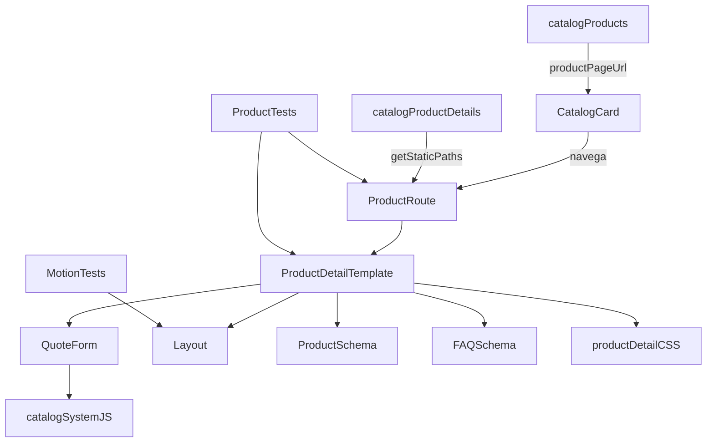

# MANEXT — Knowledge map de la plantilla de producto

La documentación canónica está en `docs/catalogo/PLANTILLA-FICHAS-PRODUCTO.md` y se refleja en Obsidian como [[Productos — Catálogo y Plantilla]].

## Nodos principales

| Nodo | Tipo | Relación |
|---|---|---|
| `catalogProducts` | dataset de cards | contiene la entrada comercial y `productPageUrl`. |
| `CatalogCard.astro` | componente | lee `productPageUrl` y enlaza **Ver ficha técnica**. |
| `catalogProductDetails` | dataset de detalle | contiene contenido, SEO, seguridad, FAQ y fuentes. |
| `getCatalogProductDetail()` | selector de datos | resuelve una ficha por slug. |
| `catalogo/[slug].astro` | route factory | genera rutas estáticas desde `catalogProductDetails`. |
| `ProductDetailTemplate.astro` | template | consume el detalle, compone secciones y genera Product/FAQ schema. |
| `QuoteForm.astro` | componente CRO | consume `selectedProduct`, productos y sectores. |
| `catalog-system.js` | controlador cliente | valida el formulario y construye el mensaje de WhatsApp. |
| `catalog-product-detail.css` | design system | define hero, ficha, variantes, seguridad y conversión responsive. |
| `Layout.astro` | shell/SEO | genera canonical, OG, breadcrumbs y política no-motion. |
| `catalog-product-detail.test.mjs` | contrato | protege ruta, SEO, schemas y conversión. |
| `motion-policy.test.mjs` | contrato | protege la regla sin animaciones. |

## Relaciones críticas

## Decisiones que deben conservarse

- La ruta nueva es `/catalogo/[slug]`; `/productos/[...slug]` queda como legacy.
- Las páginas se crean agregando datos, no duplicando archivos Astro.
- CO₂ es la referencia canónica.
- FAQ y cotización forman un mismo módulo: izquierda FAQ, derecha formulario.
- No hay precios públicos ni `Offer` schema sin datos comerciales reales.
- Canonical y enlaces internos no llevan diagonal final.
- Las afirmaciones técnicas requieren fuente primaria.
- No existen animaciones; sólo botones y CTA admiten transición.
- Toda modificación del contrato termina con `npm run build` y `npm test`.

## Expansión

Para cada producto nuevo:

1. Añadir `productPageUrl` a `catalog-products.mjs`.
2. Añadir un objeto completo a `catalog-product-details.mjs`.
3. Validar que `getStaticPaths()` genere la ruta.
4. Extender `catalog-product-detail.test.mjs`.
5. Compilar, probar y revisar desktop/móvil.

#graphify/architecture #community/Catalogo_y_Producto #proyecto/MANEXT
